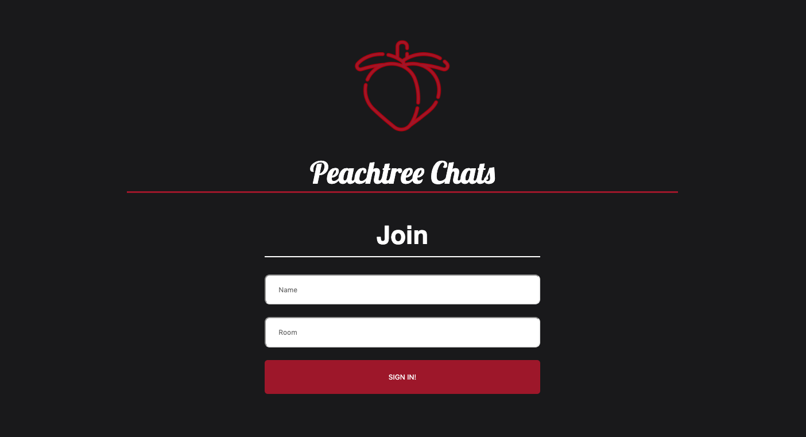
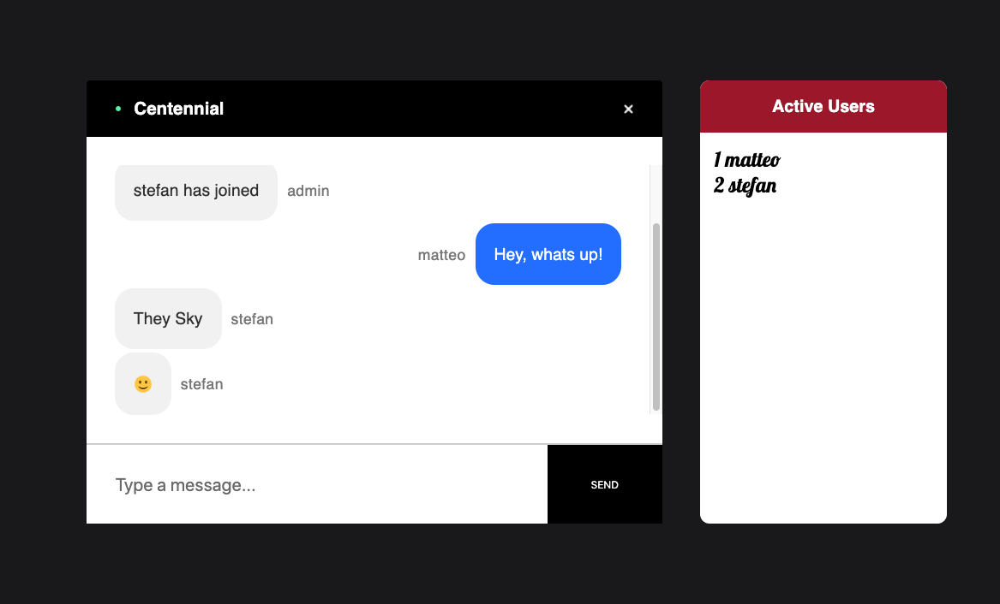
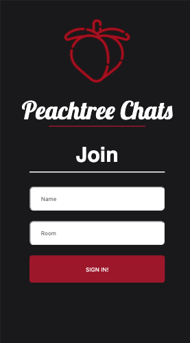
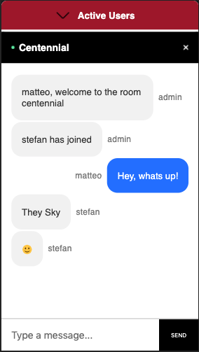
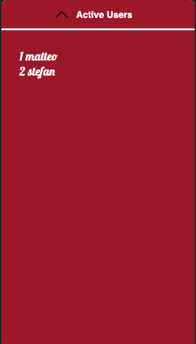

# PeachTree Chats

[Live Demo](https://peachtree.netlify.app "Live Demo")

PeachTree Chats is a Chat Application optimized for both mobile and desktop that allows users to create a temporary username
and join chat rooms where they can message in real time with one another. This was
my first project incorporating socket.io and I thoroughly enjoyed learning how to integrate
it and the functionality that it provides.

## Technologies

- React.js (frontend)
- Node.js (backend)
- Socket.io (duplex communication)

## DeskTop View

## Mobile View

